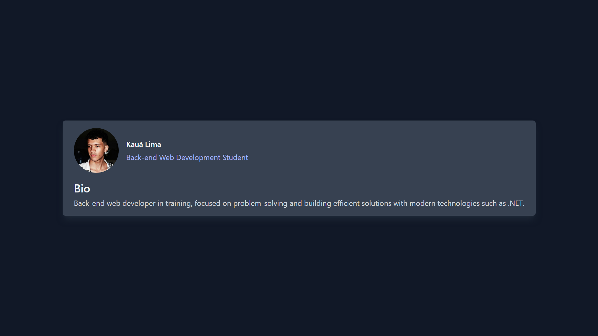

## Descrição

Esta aplicação é uma página estática com um card, desenvolvido para praticar React, TypeScript e Tailwind CSS.

## Screenshot da Aplicação

<p align="center">
  
</p>

### Requisitos

- Git
- Node.js
- Visual Studio Code

### Instalação

1. Clone o repositório:

   ```bash
   git clone https://github.com/kauatwn/profile-card-tailwindcss.git
   ```

2. Instale as dependências:

   ```bash
   npm install
   ```

3. Execute o comando:

   ```bash
   npm run dev
   ```
